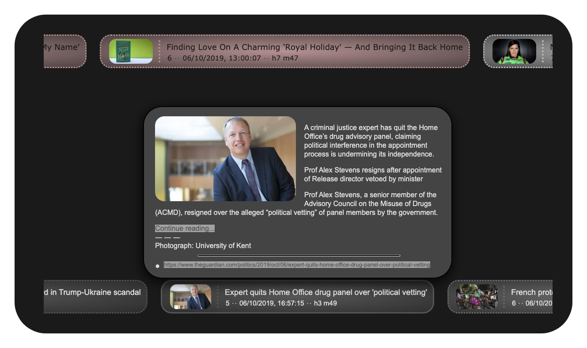

## rss-ticker v1.1.0 : RSS/Atom Feed Ticker As Custom HTML Element

***

**rss-ticker** is a custom HTML element which displays an RSS/Atom feed feed as a sequence of items which repeatedly scrolls horizontally to show all items. Using the mouse or touch, an **rss-ticker** can be controlled by dragging. To temporarily halt the ticker and show an infobox with full content, or to let it scroll forwards and backwards at different speeds.\

The items are displayed in a color that is dependent on the item's publication date. By default, a "new" item is displayed in red and an "old" item is displayed in blue. Less new and less old items are displayed with a color inbetween red and blue. Attributes can be set to change these colors and to specify when an item is "new" or "old". Changing the value of most of the attributes is immediately effective.

***




***

See [this](https://johnerps.com/rss-ticker/demo.html) page for a demonstration.

Page [johnerps.com#d](https://johnerps.com#d) also has an **rss-ticker**. Click on the yellow circle with the RSS icon (bottom half, right of the screen) to open a form in which the ticker's attributes can be changed, while it's running. Experiment with **rss-ticker** attributes. See effects immediately.

> [Documentation](https://johnerps.com/rss-ticker/docs/index.html)

***

### Usage

**rss-ticker** is simple to use. Add it to a page like any other element, set it's attributes, add some styling. No Javascript needed.

For example, the following html code adds an **rss-ticker**.

````html
<rss-ticker autostart="2" url="http://rss.cnn.com/rss/edition.rss"></rss-ticker>
````

It automatically starts 2 seconds after being attached to the DOM. It fetches RSS/Atom feed http://rss.cnn.com/rss/edition.rss.

It happens that a feed can not be fetched due to, for example, CORS restrictions. Attribute `proxy-url` is used to fetch the feed through another server (for example the one that served the page) to mitigate the restrictions.

The [demo page](https://johnerps.com/rss-ticker/demo.html) has two **rss-ticker**s which are added to the page with the following html (and some styling).

````html
<rss-ticker id="rss1"
    url="http://rss.cnn.com/rss/edition.rss"
    proxy-url="https://johnerps.com/php/getfile.php?url=%%_URL_%%"
    autostart="3"
    speed="2.5"
    color-new="#a44"
    color-old="#bbb"
    hrs-old="6"
    transparency="0.3"
    infobox-link-bgcolor="#1a1a1a"
    font-size="1.3"
></rss-ticker>
<rss-ticker id="rss2"
    url="https://www.theguardian.com/uk/rss"
    proxy-url="https://johnerps.com/php/getfile.php?url=%%_URL_%%"
    autostart="5"
    speed="4"
    infobox-img-size="3"
    color-new="#888"
    color-old="#333"
    transparency="0.3"
    infobox-link-color="#1a1a1a"
    infobox-link-bgcolor="#b0b0b0"
></rss-ticker>
````

The page with the `<rss-ticker>` element(s) must have modules **webcomponentsjs** (for browser compatibility) and **rss-ticker** added to the `<head>` element.

````html
<head>
    .
    .
    <script src="https://unpkg.com/@webcomponents/webcomponentsjs"></script>
    <script src="https://unpkg.com/rss-ticker"></script>
</head>
````

The HTML element class of **rss-ticker** is bound to property `default` of global variable `RssTicker`.

`RssTicker.default`

**rss-ticker** can also be consumed as an ES2015 module, when using Javascript and a tool like webpack.

````javascript
import RssTicker from 'rss-ticker';
````

Or as a CommonJS module.

````javascript
var RssTicker = require('rss-ticker');
````

***

### How To Build

First install node and npm.

Then,

````shell
$ git clone https://github.com/jerps/rss-ticker.git
$ cd rss-ticker
$ npm run build:prod
# for development:
$ npm run build:dev
````

***

### License

rss-ticker is [MIT Licensed](LICENSE). You may use, distribute and copy it under the license terms.

***

### Changes

* v1.1.0 (2019-11-2)

  * Some bugfixes.
  * Added documentation.

* v1.0.1 (2019-10-12)

  * Changed default (proxy) url to be empty.

* v0.9.0 (2019-10-07)

  * Bugfixes / misc. lay-out changes.

  * Added attribute `descr-or-content`.

  * Pre-load info-box images.

* v0.8.2 (october 7, 2019)

  * Some bugfixes.

  * demo.html styling.

* v0.8.1 (october 6, 2019)

  * Some bugfixes.

  * Changed boolean `autostart` attribute to be the number of seconds to wait before start (0 = no autostart).

  * Added attribute `infobox-img-size`.

* v0.8.0 (october 6, 2019)

  * Bugfixes.

  * Added attribute `autostart`. Renamed attribute `moveright` to `scrollright`.

  * Added demo.html.

  * Started writing docs.

* v0.7.2 (october 5, 2019)

  * Bugfixes.

* v0.7.1 (september 29, 2019)

  * Show item sequence number.

* v0.7.0 (september 29, 2019)

  * Several bugfixes.

  * Changed defaults of attrs `url` and `proxy-url`.

  * The ticker items now center vertically within the vertical space of the rss-ticker element.

  * When `running` event is triggered the information object now also contains property `inum` which is the number of items.

* v0.6.0 (september 28, 2019)

  * Misc. changes & bugfixes.

* v0.5.0 (september 15, 2019)

  * Some bugfixes.

  * Added static read-only property `apNames` to `RssTicker`. It gives an array with all attribute/property names.

  * rss-ticker is now stable and fully functional.

* v0.4.1 (september 15, 2019)

  * Added static method `apNames` to return an array with attribute/property names.

* v0.4.0 (september 15, 2019)

  * Bugfixes. Misc. changes.

  * Added node_modules to repository.

* v0.3.3 (september 14, 2019)

  * Bugfixes.

* v0.3.2 (september 14, 2019)

  * Upgraded node modules.

* v0.3.1 (september 14, 2019)

  * Misc changes & bugfixes.

* v0.3.0 (july 5, 2019)

  * Misc. bugfixes. Added polyfills. Stable.

* v0.2.0 (june 24, 2019)

  * Used webpack/babel for packaging.

* v0.1.0 (may 22, 2019)

  * First working version.

* v0.0.0 (may 2019)

  * Initial commit. WIP.
